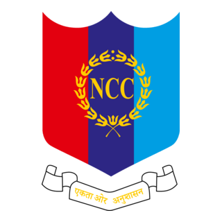

  
   
  <h1>Sairam NCC Official Website 🇮🇳</h1>
  
<strong>A Premium, Dynamic, and Fully-Featured Web Experience for the National Cadet Corps of Sri Sairam Engineering College</strong>

  <i>Designed and Developed independently by <b>Ash-lash</b></i>
    
  
Click here to see the Official Webiste of Sairam NCC <a href="http://sairamncc.in"> Sairam NCC</a>

  

    React • Firebase • Framer Motion • Styled-Components • GSAP
  

## 🌟 Overview

Welcome to the **Sairam NCC Website**, a state-of-the-art web application crafted to represent the discipline, achievements, and vibrant community of Sairam NCC. 

This platform isn't just an informational site; it's a completely bespoke digital experience built from the ground up to leave a lasting impression. From buttery-smooth micro-animations to a robust administrative backend, every single pixel and feature has been engineered with a singular focus on achieving a "WOW factor". 

> **Developer's Note:** This entire project was architected, designed, and developed entirely by me, **Ash-lash**, as a solo developer, showcasing modern full-stack capabilities, exquisite UI/UX design, and complex data management.

## ✨ Key Features

### 🎨 Unmatched Premium UI/UX
- **Dynamic Micro-animations:** Powered by `Framer Motion` and `GSAP`, featuring snow effects, exploding page transitions, and elegant hover physics.
- **Glassmorphism & Gradients:** Straying away from generic layouts with carefully curated HSL color palettes, deep nautical blues, and striking gold accents.
- **Flawless Responsiveness:** Perfect rendering on everything from ultra-wide monitors to mobile devices.

### 🛡 Core Functionalities
- **Cadet & Alumni Directory:** A seamless, unified database combining active cadets and distinguished alumni with high-quality profile cards and filtering.
- **Squad & Individual Achievements:** A highly advanced achievements engine capable of sorting individual accolades and dynamic "Squad Compositions" for group awards, complete with individual constituent tracking.
- **Voices of Valor (Cadet Blogs):** A dedicated blogging engine directly inside the platform for cadets to share their camp logs, experiences, and leadership perspectives.
- **Real-Time Gallery & Events:** Dynamic grid layouts using `react-zoom-pan-pinch` and optimized image deliveries to maintain lightning-fast load times.
- **Centralized Downloads & Syllabus:** Tabbed interfaces for quick access to parade schedules, study materials, and camp documents.

### 🔐 Advanced Admin Dashboard
- **Secure Authentication:** Role-based access exclusively for authorized officers and administrators.
- **Complete CMS:** Drag-and-drop reordering, interactive image uploads with real-time resizing hints, and seamless CRUD operations mapped directly to Firestore.
- **Group Metadata Management:** Intelligently handles uploading multiple squad members (photos, ranks, departments, and wings) into single cohesive database records.

## 💻 Technology Stack

- **Frontend:** React.js (v18+), React Router v6
- **Styling:** Vanilla CSS, Styled-Components (for complex dynamic styling without clutter)
- **Animations:** Framer Motion, GSAP (GreenSock Animation Platform)
- **Backend/Database:** Firebase Firestore (NoSQL)
- **File Storage:** Firebase Storage (with real-time file previews)
- **Hosting:** Firebase Hosting (Blazing fast global CDN)
- **Utilities:** Lucide-React for pristine iconography

## 🚀 Future Roadmap
- [ ] PWA (Progressive Web App) compliance for offline viewing.
- [ ] Integration with Airtable / automated report generation.
- [ ] AI-driven smart search for the Alumni directory.

 

  
Built with ❤️, Sweat, and Code by <a href="https://github.com/Ash-lash">Ash-lash</a>

  
© 2026 Sairam NCC. All Rights Reserved.

